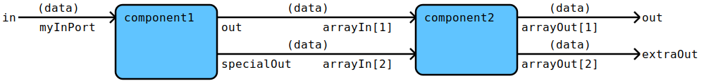

# gflowparser
Flow DSL parser for the Go programming language build with flowdev/gparselib.

## Status
This project is already quite useful (especially when used via the `go2md` project).
But the following points are still missing:
1. [ ] Complete documentation
1. [ ] Refactor the `data2svg` package into flows
1. [ ] Add missing tests and fix bugs

## Flow DSL
The flow DSL is used to show the flow of data between components. So it consists of two main objects:
- components that perform computations, I/O, etc. and
- arrows that connect components and transport the defined data into the second component.

Components can have explicit ports that they use to receive or provide data.
The default ports are `in` for input and `out` for output.

So a very simple flow looks like this:
```flowdev
in (data)-> [component1] (data)-> [component2] (data)-> out
```
and is rendered to:

As you can see, the ports at the outer level (usually at the very start and end
of a flow line) have to be stated explicitly even if they are the standard
ports.

Generally new lines and comments are fine when seperating flow lines and
within parentheses (`(` and `)`) and square brackets (`[` and `]`).

### Data and data types
Multiple data for arrows are supported and can either be seperated by a comma (`,`)
to keep them on the same line or by a pipe (`|`) to have multiple lines:
```flowdev
in (data1, data2, data3)-> [component1] (data4 | data5 | data6)-> [
component2] (data1, data3 | data5, data6)-> out
```


Data types can be upper case (exported) or lower case (local). A package name
separated by dot (`.`) can be prepended to a data type.
Simple data types like `string`, `int` and `bool` don't provide much
information so instead the more descriptive name of the parameter should be
used instead. 
```flowdev
in (localDataType, ExportedLocalDataType | otherpackage.ExportedDataType)-> [
component1] (ExportedLocalDataType | descriptiveNameForString)-> out
```


### Ports
Ports have lower case names and can have an optional index (array ports).
The maximum index is fix at design time (compile time) as anything else would
be too hard to debug.
In the Go code input port names are appended to the function or method name
seperated by an underscore (`_`) (e.g. `func component1_myInPort(...)`).
```flowdev
in (data)-> myInPort [component1] out (data)-> arrayIn:1 [component2] arrayOut:1 (data)-> out
[component1] specialOut (data)-> arrayIn:2 [component2] arrayOut:2 (data)-> extraOut
```


### Continuations
Flows can get quite long and it is nice to be able to continue them on a new
line.  You can use continuations for that. A continuation is simply three dots
(`...`) followed by a number.  That allows more complicated flow forms, too.
```flowdev
in (data)-> [component1] -> ...1
...1 (data)-> [component2] -> ...2
...2 (data)-> [component3]
```


### Components
Flow components generally have got a name and a type. If no explicit name is
given, it is generated from the type using the following rules:

- The optional package part of the type is ignored when generating the name.
- A lower case type is used unchanged as name, too.
- Upper case types are converted to lower case for the name.

```flowdev
in (data)-> [component1] (data)-> [Component2] (data)-> out
in2 (data)-> [package.Component3] (data)-> [explicitName Component4] (data)-> out2
```


### Plugins
In order to keep diagrams and code clean it components can have plugins.
Plugins are simple functions (as seen from the component using them).  So they
are just like components with only one input port, an optional output port and
optional error port. It is possible that the plugin is used as a normal
component elsewhere. We simply use normal (component) data types for plugins.
```flowdev
in (data)-> [component [plugin]] (data)-> out
```


Multiple plugins of the same type (same Go function signature) are supported,
too.
```flowdev
in (data)-> [component [pluginType = package.Plugin1, plugin2, Plugin3]] (data)-> out
```


If there is only one plugin of a type, the plugin type can be omited since it
usually is the same as the plugin itself.  Plugins of different types can be
used, too.
```flowdev
in (data)-> [component [simplePlugin | pluginType = package.Plugin1, plugin2, Plugin3]] (data)-> out
```


I hope you recognise the thicker separator line between plugins of different
types.

### Splits
Components can have got multiple output ports and/or be connected to multiple
downstream components. The first time a component is used it is defined with
optional name and type. All other times only the unique name is used to refer
to it.
```flowdev
in (data)-> [component1] (data)-> [Component2] (data)-> out
[component1] error (err)-> error
[component2] error (err)-> error
in2 (data)-> [package.Component3] (data)-> [explicitName Component4] (data)-> out2
[component3] error (err)-> error
[explicitName] error (err)-> error
```


### Merges
Merges are the opposite of splits and the same rules apply. Merges are used for
components that have got multiple input ports and/or that are connected to
multiple upstream components.
```flowdev
in (data)-> [component1] (data)-> [Component2] (data)-> out
in2 (data2)-> [component1]
in3 (data3)-> [component2]
in4 (data4)-> [package.Component3] (data)-> [explicitName Component4] (data)-> out2
in5 (data5)-> [component3]
in6 (data6)-> [explicitName]
```


### Circles
The flow DSL allows to create circles. As these are graphically challenging the
tool breaks them up and replaces the component that completes the circle with a
textual reference (`... back to: <component name>`).
```flowdev
in (data)-> [component1] (data)-> [Component2] (data)-> [component1]
```

