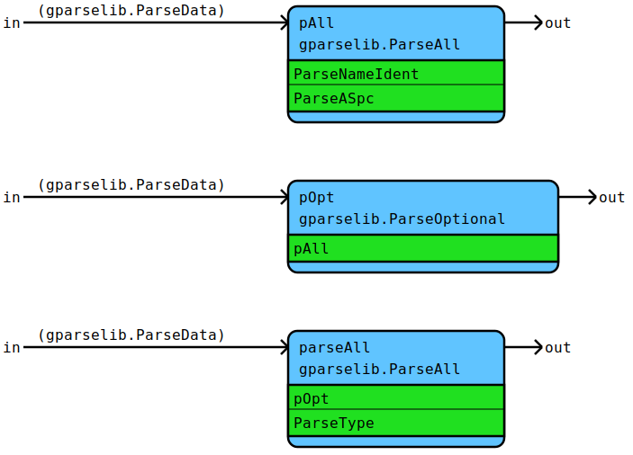
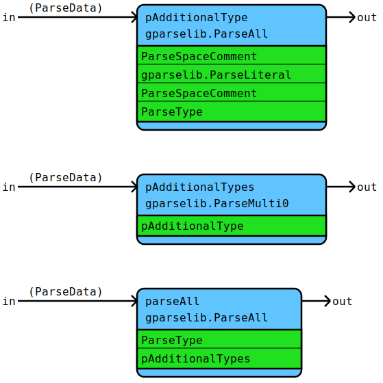
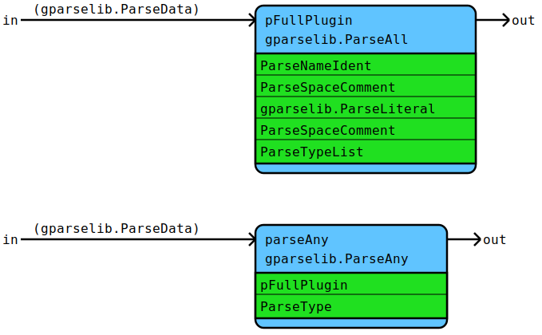
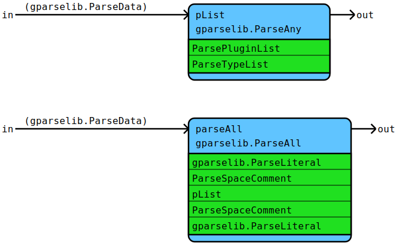
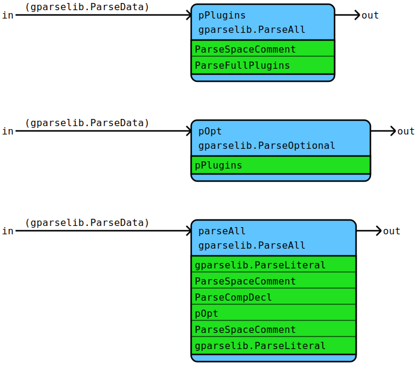

# Flow Documentation For File: component.go

## Flow: [ParseType](component.go#L38L88)
ParseType parses a type declaration including optional package.
* Semantic result: The optional package name and the local type name
  including possible subtypes in case of a map or a list (data.Type).

Components | Data
---------- | -----
[ParseLocalTypeIdent](utils.md#flow-parselocaltypeident) | [gparselib.ParseData](https://github.com/flowdev/gparselib/blob/master/base.go#L105L109)
[ParsePackageIdent](utils.md#flow-parsepackageident) | 
pOpt | 
[gparselib.ParseAll](https://github.com/flowdev/gparselib/blob/master/complex_parser.go#L127L151) | 
[gparselib.ParseOptional](https://github.com/flowdev/gparselib/blob/master/complex_parser.go#L100L116) | 

## Flow: [ParseCompDecl](component.go#L138L159)
ParseCompDecl parses a component declaration.
* Semantic result: The name and the type (data.CompDecl).

Components | Data
---------- | -----
[ParseASpc](utils.md#flow-parseaspc) | [gparselib.ParseData](https://github.com/flowdev/gparselib/blob/master/base.go#L105L109)
[ParseNameIdent](utils.md#flow-parsenameident) | 
[ParseType](#flow-parsetype) | 
pAll | 
pOpt | 
[gparselib.ParseAll](https://github.com/flowdev/gparselib/blob/master/complex_parser.go#L127L151) | 
[gparselib.ParseOptional](https://github.com/flowdev/gparselib/blob/master/complex_parser.go#L100L116) | 

## Flow: [ParseTypeList](component.go#L202L218)
ParseTypeList parses types separated by commas.
* Semantic result: []data.Type

Components | Data
---------- | -----
[ParseSpaceComment](utils.md#flow-parsespacecomment) | [gparselib.ParseData](https://github.com/flowdev/gparselib/blob/master/base.go#L105L109)
[ParseType](#flow-parsetype) | 
pAdditionalType | 
pAdditionalTypes | 
[gparselib.ParseAll](https://github.com/flowdev/gparselib/blob/master/complex_parser.go#L127L151) | 
[gparselib.ParseLiteral](https://github.com/flowdev/gparselib/blob/master/simple_parser.go#L15L34) | 
[gparselib.ParseMulti0](https://github.com/flowdev/gparselib/blob/master/complex_parser.go#L66L71) | 

## Flow: [ParsePlugin](component.go#L268L297)
ParsePlugin parses a name followed by an equals sign and types separated by commas.
Alternatively a single type is parsed.
* Semantic result: The title and a slice of data.Type (data.Plugin).

Components | Data
---------- | -----
[ParseNameIdent](utils.md#flow-parsenameident) | [gparselib.ParseData](https://github.com/flowdev/gparselib/blob/master/base.go#L105L109)
[ParseSpaceComment](utils.md#flow-parsespacecomment) | 
[ParseType](#flow-parsetype) | 
[ParseTypeList](#flow-parsetypelist) | 
pFullPlugin | 
[gparselib.ParseAll](https://github.com/flowdev/gparselib/blob/master/complex_parser.go#L127L151) | 
[gparselib.ParseAny](https://github.com/flowdev/gparselib/blob/master/complex_parser.go#L164L196) | 
[gparselib.ParseLiteral](https://github.com/flowdev/gparselib/blob/master/simple_parser.go#L15L34) | 

## Flow: [ParsePluginList](component.go#L327L344)
ParsePluginList parses Plugins separated by a pipe '|' character.
* Semantic result: A slice of data.Plugin.

Components | Data
---------- | -----
[ParsePlugin](#flow-parseplugin) | [gparselib.ParseData](https://github.com/flowdev/gparselib/blob/master/base.go#L105L109)
[ParseSpaceComment](utils.md#flow-parsespacecomment) | 
pAdditionalList | 
pAdditionalLists | 
[gparselib.ParseAll](https://github.com/flowdev/gparselib/blob/master/complex_parser.go#L127L151) | 
[gparselib.ParseLiteral](https://github.com/flowdev/gparselib/blob/master/simple_parser.go#L15L34) | 
[gparselib.ParseMulti0](https://github.com/flowdev/gparselib/blob/master/complex_parser.go#L66L71) | 

## Flow: [ParseFullPlugins](component.go#L391L404)
ParseFullPlugins parses the plugins of an operation starting with a '[' followed
by a plugin list or a type list and a closing ']'.
* Semantic result: A slice of data.Plugin.

Components | Data
---------- | -----
[ParsePluginList](#flow-parsepluginlist) | [gparselib.ParseData](https://github.com/flowdev/gparselib/blob/master/base.go#L105L109)
[ParseSpaceComment](utils.md#flow-parsespacecomment) | 
[ParseTypeList](#flow-parsetypelist) | 
pList | 
[gparselib.ParseAll](https://github.com/flowdev/gparselib/blob/master/complex_parser.go#L127L151) | 
[gparselib.ParseAny](https://github.com/flowdev/gparselib/blob/master/complex_parser.go#L164L196) | 
[gparselib.ParseLiteral](https://github.com/flowdev/gparselib/blob/master/simple_parser.go#L15L34) | 

## Flow: [ParseComponent](component.go#L451L468)
ParseComponent parses a component including declaration and plugins.
* Semantic result: A data.Component.

Components | Data
---------- | -----
[ParseCompDecl](#flow-parsecompdecl) | [gparselib.ParseData](https://github.com/flowdev/gparselib/blob/master/base.go#L105L109)
[ParseFullPlugins](#flow-parsefullplugins) | 
[ParseSpaceComment](utils.md#flow-parsespacecomment) | 
pOpt | 
pPlugins | 
[gparselib.ParseAll](https://github.com/flowdev/gparselib/blob/master/complex_parser.go#L127L151) | 
[gparselib.ParseLiteral](https://github.com/flowdev/gparselib/blob/master/simple_parser.go#L15L34) | 
[gparselib.ParseOptional](https://github.com/flowdev/gparselib/blob/master/complex_parser.go#L100L116) | 

