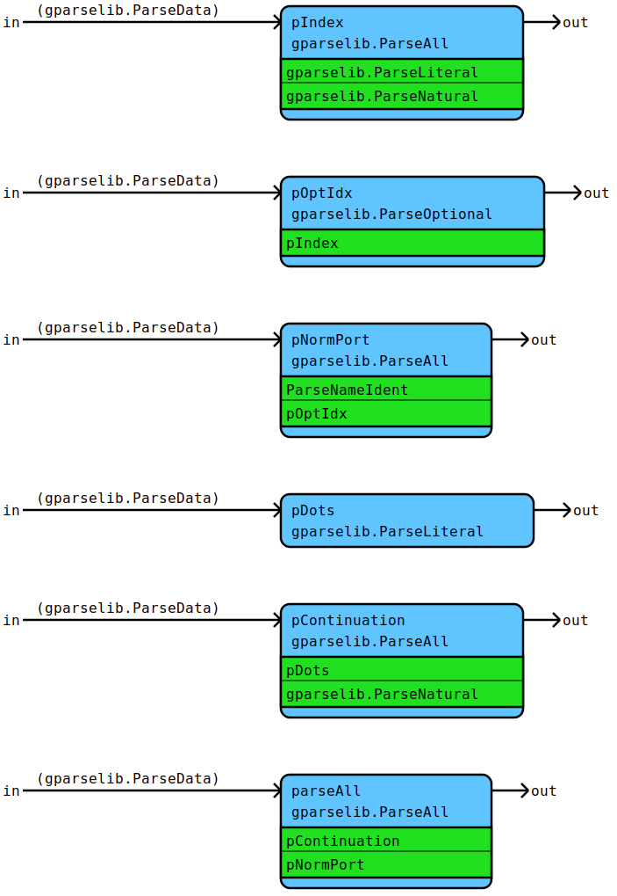
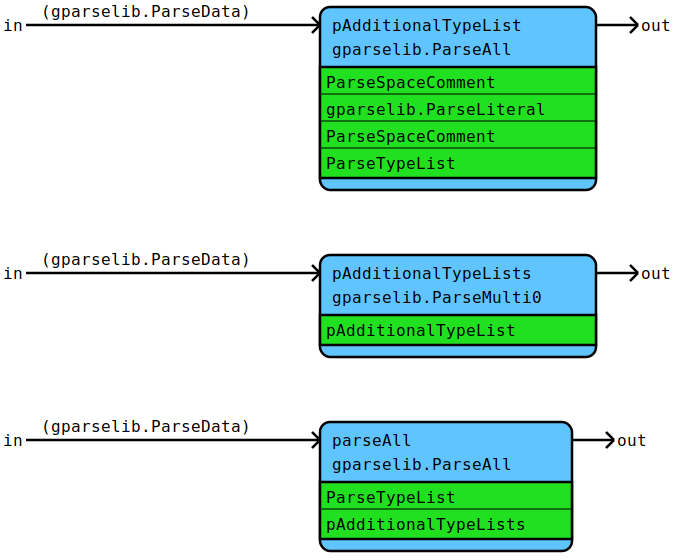
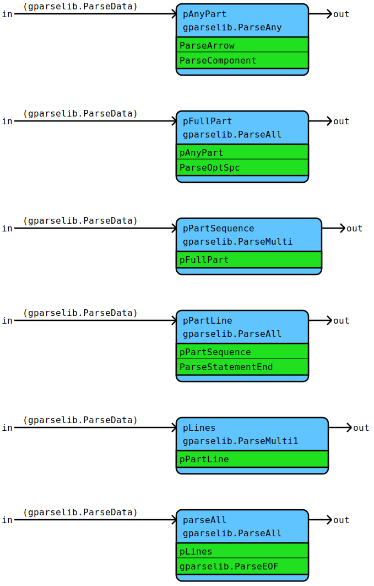

# Flow Documentation For File: flow.go

## Flow: [ParsePort](flow.go#L37L56)
ParsePort parses a port including optional index.
* Semantic result: data.Port

Components | Data
---------- | -----
[ParseNameIdent](utils.md#flow-parsenameident) | [gparselib.ParseData](https://github.com/flowdev/gparselib/blob/master/base.go#L105L109)
[gparselib.ParseAll](https://github.com/flowdev/gparselib/blob/master/complex_parser.go#L127L151) | 
[gparselib.ParseLiteral](https://github.com/flowdev/gparselib/blob/master/simple_parser.go#L15L34) | 
[gparselib.ParseNatural](https://github.com/flowdev/gparselib/blob/master/simple_parser.go#L49L91) | 
[gparselib.ParseOptional](https://github.com/flowdev/gparselib/blob/master/complex_parser.go#L100L116) | 

## Flow: [ParseMultiTypeList](flow.go#L108L124)
ParseMultiTypeList parses multiple type lists (types separated
by ',') separated by '|'.
* Semantic result: []data.Type containing data.SeparatorType

Components | Data
---------- | -----
[ParseSpaceComment](utils.md#flow-parsespacecomment) | [gparselib.ParseData](https://github.com/flowdev/gparselib/blob/master/base.go#L105L109)
[ParseTypeList](component.md#flow-parsetypelist) | 
[gparselib.ParseAll](https://github.com/flowdev/gparselib/blob/master/complex_parser.go#L127L151) | 
[gparselib.ParseLiteral](https://github.com/flowdev/gparselib/blob/master/simple_parser.go#L15L34) | 
[gparselib.ParseMulti0](https://github.com/flowdev/gparselib/blob/master/complex_parser.go#L66L71) | 

## Flow: [ParseArrow](flow.go#L180L205)
ParseArrow parses a flow arrow including ports and data types.
* Semantic result: data.Arrow

Components | Data
---------- | -----
[ParseMultiTypeList](#flow-parsemultitypelist) | [gparselib.ParseData](https://github.com/flowdev/gparselib/blob/master/base.go#L105L109)
[ParseOptSpc](utils.md#flow-parseoptspc) | 
[ParsePort](#flow-parseport) | 
[ParseSpaceComment](utils.md#flow-parsespacecomment) | 
[gparselib.ParseAll](https://github.com/flowdev/gparselib/blob/master/complex_parser.go#L127L151) | 
[gparselib.ParseLiteral](https://github.com/flowdev/gparselib/blob/master/simple_parser.go#L15L34) | 
[gparselib.ParseOptional](https://github.com/flowdev/gparselib/blob/master/complex_parser.go#L100L116) | 

## Flow: [ParseFlow](flow.go#L278L305)
ParseFlow parses a complete flow.
* Semantic result: data.Flow

Components | Data
---------- | -----
[ParseArrow](#flow-parsearrow) | [gparselib.ParseData](https://github.com/flowdev/gparselib/blob/master/base.go#L105L109)
[ParseComponent](component.md#flow-parsecomponent) | 
[ParseOptSpc](utils.md#flow-parseoptspc) | 
[ParseStatementEnd](utils.md#flow-parsestatementend) | 
[gparselib.ParseAll](https://github.com/flowdev/gparselib/blob/master/complex_parser.go#L127L151) | 
[gparselib.ParseAny](https://github.com/flowdev/gparselib/blob/master/complex_parser.go#L164L196) | 
[gparselib.ParseEOF](https://github.com/flowdev/gparselib/blob/master/simple_parser.go#L108L127) | 
[gparselib.ParseMulti](https://github.com/flowdev/gparselib/blob/master/complex_parser.go#L11L50) | 
[gparselib.ParseMulti1](https://github.com/flowdev/gparselib/blob/master/complex_parser.go#L83L88) | 

