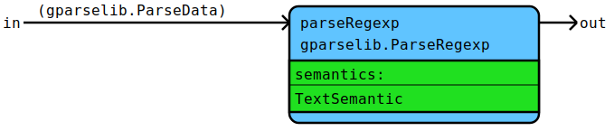

# Flow Documentation For File: parse_utils.go

## Flow: ParseNameIdent
ParseNameIdent parses a name identifier.
* Regexp: [a-z][a-zA-Z0-9]*
* Semantic result: The parsed text.

Components | Data
---------- | -----
[TextSemantic](parse_utils.go#L203L206) | [gparselib.ParseData](https://github.com/flowdev/gparselib/blob/master/base.go#L105L109)
[gparselib.ParseRegexp](https://github.com/flowdev/gparselib/blob/master/simple_parser.go#L157L179) | 

## Flow: ParsePackageIdent
ParsePackageIdent parses a package identifier.
* Regexp: [a-z][a-z0-9]*\.
* Semantic result: The parsed text (without the dot).

Components | Data
---------- | -----
[TextSemantic](parse_utils.go#L203L206) | [gparselib.ParseData](https://github.com/flowdev/gparselib/blob/master/base.go#L105L109)
[gparselib.ParseRegexp](https://github.com/flowdev/gparselib/blob/master/simple_parser.go#L157L179) | 

