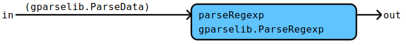
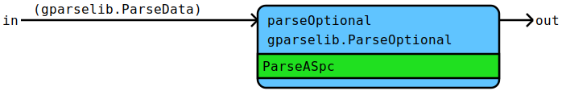

# Flow Documentation For File: utils.go

## Flow: [ParseNameIdent](utils.go#L30L34)
ParseNameIdent parses a name identifier.
* Regexp: [a-z][a-zA-Z0-9]*
* Semantic result: The parsed text.

Components | Data
---------- | -----
[TextSemantic](utils.go#L204L207) | [gparselib.ParseData](https://github.com/flowdev/gparselib/blob/master/base.go#L105L109)
[gparselib.ParseRegexp](https://github.com/flowdev/gparselib/blob/master/simple_parser.go#L188L209) | 

## Flow: [ParsePackageIdent](utils.go#L52L60)
ParsePackageIdent parses a package identifier.
* Regexp: [a-z][a-z0-9]*\.
* Semantic result: The parsed text (without the dot).

Components | Data
---------- | -----
[TextSemantic](utils.go#L204L207) | [gparselib.ParseData](https://github.com/flowdev/gparselib/blob/master/base.go#L105L109)
[gparselib.ParseRegexp](https://github.com/flowdev/gparselib/blob/master/simple_parser.go#L188L209) | 

## Flow: [ParseLocalTypeIdent](utils.go#L78L81)
ParseLocalTypeIdent parses a local (without package) type identifier.
* Regexp: [A-Za-z][a-zA-Z0-9]*
* Semantic result: The parsed text.

Components | Data
---------- | -----
[TextSemantic](utils.go#L204L207) | [gparselib.ParseData](https://github.com/flowdev/gparselib/blob/master/base.go#L105L109)
[gparselib.ParseRegexp](https://github.com/flowdev/gparselib/blob/master/simple_parser.go#L188L209) | 

## Flow: [ParseOptSpc](utils.go#L89L91)
ParseOptSpc parses optional space but no newline.
* Semantic result: The parsed text.

Components | Data
---------- | -----
[ParseASpc](#flow-parseaspc) | [gparselib.ParseData](https://github.com/flowdev/gparselib/blob/master/base.go#L105L109)
[TextSemantic](utils.go#L204L207) | 
[gparselib.ParseOptional](https://github.com/flowdev/gparselib/blob/master/complex_parser.go#L100L116) | 

## Flow: [ParseASpc](utils.go#L98L100)
ParseASpc parses space but no newline.
* Semantic result: The parsed text.

Components | Data
---------- | -----
[TextSemantic](utils.go#L204L207) | [gparselib.ParseData](https://github.com/flowdev/gparselib/blob/master/base.go#L105L109)
[gparselib.ParseSpace](https://github.com/flowdev/gparselib/blob/master/simple_parser.go#L139L161) | 

## Flow: [ParseSpaceComment](utils.go#L135L150)
ParseSpaceComment parses any amount of space (including newline) and line
(`//` ... <NL>) and block (`/*` ... `*/`) comments.
* Semantic result: The parsed text plus a signal whether a newline was
  parsed.

Components | Data
---------- | -----
[TextSemantic](utils.go#L204L207) | [gparselib.ParseData](https://github.com/flowdev/gparselib/blob/master/base.go#L105L109)
pAny | 
pBlkCmnt | 
pLnCmnt | 
pSpc | 
[spaceCommentSemantic](utils.go#L113L118) | 
[gparselib.ParseAny](https://github.com/flowdev/gparselib/blob/master/complex_parser.go#L164L196) | 
[gparselib.ParseBlockComment](https://github.com/flowdev/gparselib/blob/master/simple_parser.go#L284L371) | 
[gparselib.ParseLineComment](https://github.com/flowdev/gparselib/blob/master/simple_parser.go#L229L260) | 
[gparselib.ParseMulti0](https://github.com/flowdev/gparselib/blob/master/complex_parser.go#L66L71) | 
[gparselib.ParseSpace](https://github.com/flowdev/gparselib/blob/master/simple_parser.go#L139L161) | 

## Flow: [ParseStatementEnd](utils.go#L174L201)
ParseStatementEnd parses optional space and comments as defined by
`ParseSpaceComment` followed by a semicolon (`;`) and more optional space
and comments.
The semicolon can be omited if the space or comments contain a new line or
at the end of the input.
* Semantic result: The parsed text.

Components | Data
---------- | -----
BooleanSemantic | [gparselib.ParseData](https://github.com/flowdev/gparselib/blob/master/base.go#L105L109)
[ParseSpaceComment](#flow-parsespacecomment) | 
[TextSemantic](utils.go#L204L207) | 
checkSemicolonOrNewLineOrEOF | 
nil | 
pEOF | 
pOptEOF | 
pOptSemi | 
pSemicolon | 
[gparselib.ParseAll](https://github.com/flowdev/gparselib/blob/master/complex_parser.go#L127L151) | 
[gparselib.ParseEOF](https://github.com/flowdev/gparselib/blob/master/simple_parser.go#L108L127) | 
[gparselib.ParseLiteral](https://github.com/flowdev/gparselib/blob/master/simple_parser.go#L15L34) | 
[gparselib.ParseOptional](https://github.com/flowdev/gparselib/blob/master/complex_parser.go#L100L116) | 

